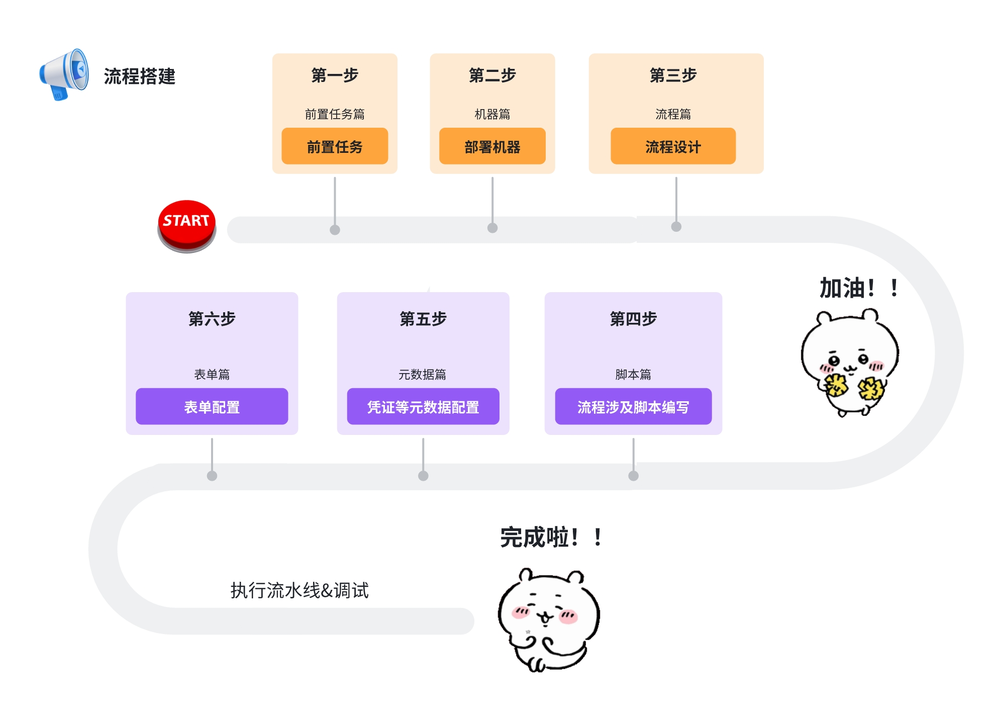
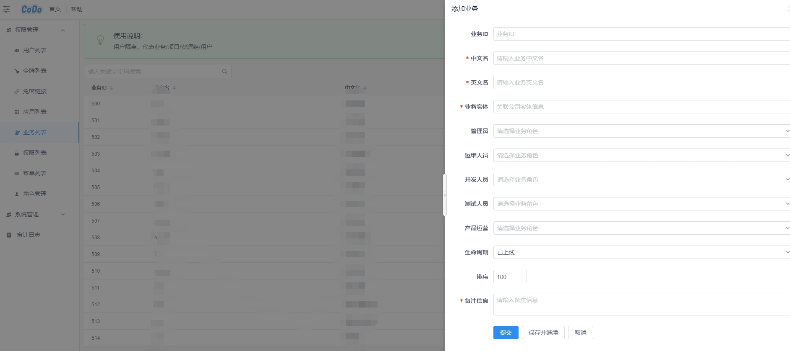

# 文章前言

关于流程开发的最佳实践以及pi全流程，我们已有详细的视频教程：[xxx]()。从22min - 60min
是实机演示搭建一个流水线的所有步骤。如果有懒得看文字的小伙伴可以直接查看视频学习哦～！
不想看这么多，想快速开始？ 移步 CODO流程开发服务享受一站式服务。

# 第一步：前置任务篇

## 全新项目必看：

> 权限开通联系管理员

1. 新建业务

## 已有项目请看：
- 请确保拥有CODO对业务权限